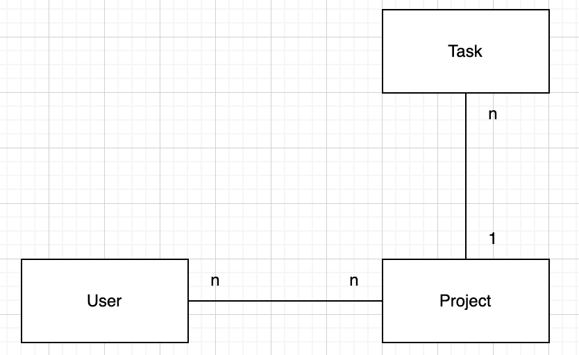

# CRUD Operations

## How is the data being handled from the front-end to the back-end and database, and back?
The client makes a request within one of the views which calls the appropriate controller. For example the dashboard page calls the project controller in order to find all the projects that are associated with the logged in user. The controller then utilizes the models created in Laravel to communicate with the database: in this case the Project model. Now the relevant projects can be passed back up from the database to the controller, and further up to the initial view.

## What are the HTTP methods used in your application for each operation?
I use all the main HTTP methods

By using `Route::resource('projects', ProjectController::class)`, Laravel automatically generates these 7 routes. 
This follows the **RESTful** pattern for CRUD operations:

| HTTP Verb | URI                    | Route Name         | Controller Method | Description                          |
|-----------|------------------------|--------------------|-------------------|--------------------------------------|
| **GET** | `/projects`            | `projects.index`   | `index`           | Display a list of all projects.      |
| **GET** | `/projects/create`     | `projects.create`  | `create`          | Show the form for creating a new one.|
| **POST** | `/projects`            | `projects.store`   | `store`           | Store a newly created project in DB. |
| **GET** | `/projects/{project}`  | `projects.show`    | `show`            | Display a specific project.          |
| **GET** | `/projects/{id}/edit`  | `projects.edit`    | `edit`            | Show the form for editing a project. |
| **PUT** | `/projects/{project}`  | `projects.update`  | `update`          | Update a specific project in DB.     |
| **DELETE**| `/projects/{project}`  | `projects.destroy` | `destroy`         | Delete a specific project.           |

These are the most commonly used HTTP methods.

## How did you handle the correct HTTP methods?
All the HTTP methods are wired within the web.php file. Here routes are wired up to different controller methods. This way, a view can call different controller methods through those routes.

# Models from MVC

## What is a Model in MVC?
A model in the MVC architectural paradigm is a "Data object". For example in my web application i have a model called Project. This model directyl maps to the projects table within my database. This way the model can be used by an ORM to communicate between the database and the webapplication

## What model(s) do you have in your application?
I use the following models for my web application:
- User
- Task
- Project

### If you have more than one, please explain how they relate to each other (use a class diagram)

## How is this model related to the database?
As mentioned, the models translate directly to tables in the database. This means my database has table for users, a table for tasks, and a table for projects.

## How do you use this model to retrieve or update the resources from the database?
By using Laravels ORM Eloquent, i can use these models alongside with Eloquent's methods to perform CRUD operations on resources in the database.

# Data Validation

## Is JavaScript validation enough to have consistent resources in your database? Why yes/no?
No, JavaScript alone is not enough as it runs client-side and can be turned off / manipulated by the client

## Independently of the answer to the previous question, would you validate data both at the front-end and back-end side? Why yes/no?
I would want to validate on the backend as well. This way we make sure that data that passed checks on the frontend haven’t been forced through / manipulated, and are actually valid. The frontend validation will focus more on immediate user feedback which improves user experience, while the backend ensures actual security and data integrity.

On the backend i utilize the validate() method that can validate that an incoming request fulfills certain requirements.